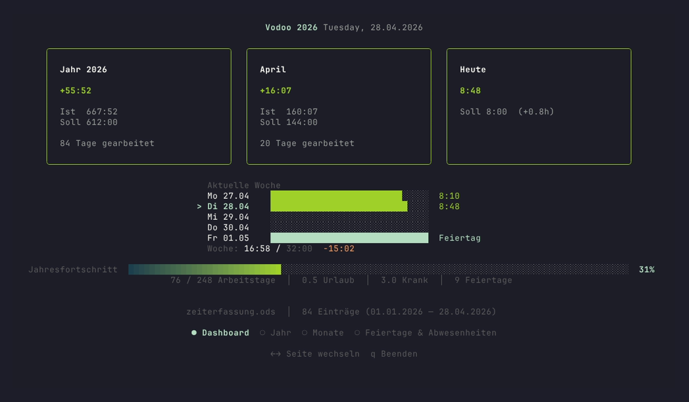
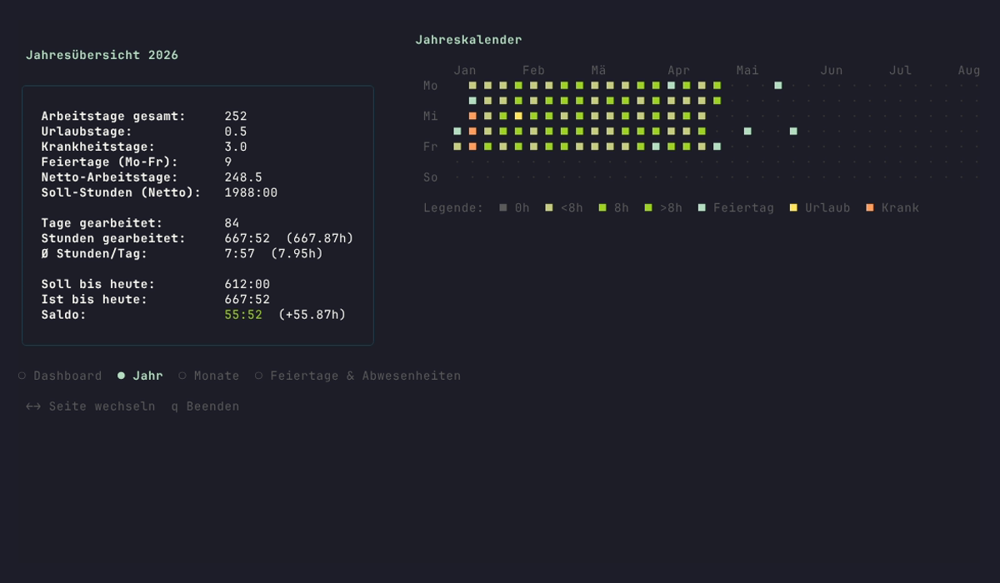
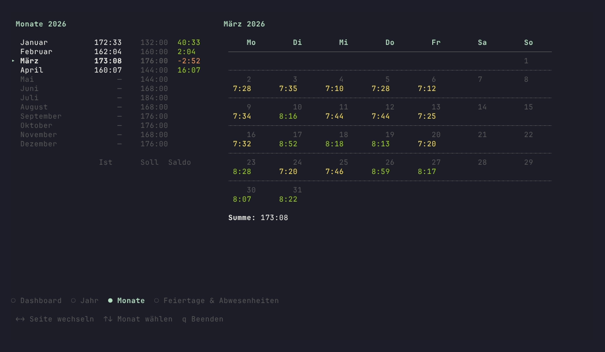
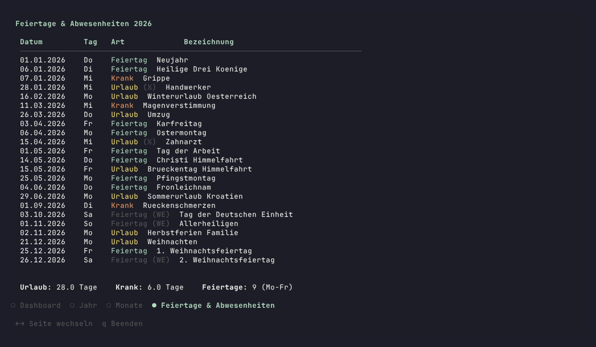

# Vodoo

Terminal-App zur Auswertung von Arbeitszeiterfassungen. Liest exportierte Zeitdaten (ODS/XLSX), Abwesenheiten und Feiertage ein und stellt sie interaktiv im Terminal dar.

Rein read-only — keine Daten werden verändert.


## Features

- **Dashboard** mit Jahres-/Monatssaldo, Wochenansicht und Fortschrittsbalken
- **Jahresansicht** mit Statistiken und GitHub-Style Heatmap-Kalender
- **Monatsansicht** mit Ist/Soll/Saldo-Liste und Tageskalender (on-hover)
- **Feiertage & Abwesenheiten** kombiniert in einer chronologischen Übersicht
- Halbtags-Abwesenheiten (0.5 Tage) werden korrekt berücksichtigt
- Fehlende Buchungen werden auf dem Dashboard angezeigt
- Navigation per Pfeiltasten — kein Menü, kein Tippen

## Voraussetzungen

- Go 1.21+

## Build

```
go build -o vodoo .
```

## Verwendung

```
./vodoo                    # liest aus ./data/
./vodoo --data dataTest    # Demo-Daten
```

### Navigation

| Taste | Aktion |
|-------|--------|
| `←` `→` | Seite wechseln |
| `↑` `↓` | Innerhalb der Seite navigieren (z.B. Monat wählen) |
| `q` | Beenden |

## Daten

Die Daten kommen aus [Odoo](https://conuti-gmbh.odoo.com) (conuti GmbH):

- **Vodoo** — [Timesheets Pivot-Export](https://conuti-gmbh.odoo.com/odoo/timesheets?view_type=pivot) als ODS oder XLSX
- **Abwesenheiten** — [Time Off List-Export](https://conuti-gmbh.odoo.com/odoo/time-off?view_type=list) als CSV
- **Feiertage** — manuell gepflegte CSV für Baden-Württemberg

Im Ordner `data/` (oder per `--data` angegeben) werden folgende Dateien erwartet:

| Datei | Quelle |
|-------|--------|
| `zeiterfassung.ods` oder `.xlsx` | Odoo Timesheets Pivot-Export |
| `abwesenheiten.csv` | Odoo Time Off List-Export |
| `feiertage.csv` | Manuell (Feiertage BW) |

### Formate

**Vodoo** (ODS/XLSX): Spalte A = Datum (`02 Jan. 2026`), Spalte B = Stunden als Dezimalzahl.

**Abwesenheiten** (CSV): Odoo-Export mit Spalten `Abwesenheitsart`, `Beschreibung`, `Dauer (Tage)`, `Startdatum`, `Enddatum`, `Status`. Nur Einträge mit Status `Genehmigt` werden berücksichtigt.

**Feiertage** (CSV): `Datum,Tag,Feiertag` mit Datum im Format `DD.MM.YYYY`.

## Screenshots

| Dashboard | Jahresansicht |
|-----------|---------------|
|  |  |

| Monatsansicht | Feiertage & Abwesenheiten |
|---------------|---------------------------|
|  |  |

## Tech Stack

- [Go](https://go.dev)
- [Bubble Tea](https://github.com/charmbracelet/bubbletea) — TUI Framework
- [Lip Gloss](https://github.com/charmbracelet/lipgloss) — Styling
- [Bubbles](https://github.com/charmbracelet/bubbles) — Table, Progress Bar
